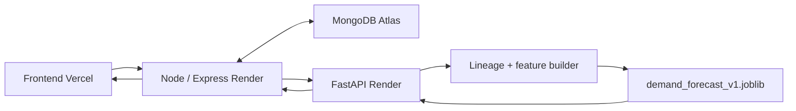

# Model card: `demand_forecast_v1`

## Identidad

| Campo | Valor |
| --- | --- |
| Nombre | `demand_forecast_v1` |
| Versión | `1.0.0` |
| Feature set | `demand-v1` |
| Algoritmo | `HistGradientBoostingRegressor` (configuración HGB-B) |
| Objetivo | Unidades vendidas acumuladas en los siete días posteriores al ancla |
| Artefacto oficial | `ml/models/demand_forecast_v1.joblib` |
| SHA-256 | `82f133a3390420556e69f090a5bdbeb4091bbe5f90f2260e790adf2b24741902` |

El archivo `model_metadata.json` y el contrato `demand_forecast_v1_contract.json` acompañan al joblib. Comprueba el hash antes de cargar el artefacto. No cargues archivos de usuarios ni artefactos joblib/pickle de origen no confiable.

## Uso previsto

El modelo se diseñó para una demostración académica, replay histórico controlado y predicción de demanda a siete días para productos con lineage, precios, calendario e historial compatibles. La aplicación consulta un modelo ya entrenado: cada petición hace inferencia y no entrena de nuevo.

No está diseñado para estimar el mercado actual sin preparación de datos reciente, aceptar productos arbitrarios o decidir compras automáticamente. La sugerencia del sistema es consultiva y requiere revisión humana.

## Datos y población

El entrenamiento utilizó M5 Forecasting, tienda CA_3: 3.049 productos, 1.941 días (2011-01-29 a 2016-05-22), 5.918.109 filas producto-día y 11.363.540 unidades. El Gold excluye días anteriores a la introducción de cada producto, determinada por el primer precio M5 no nulo, y aplica continuidad, calentamiento y elegibilidad del target.

El escenario ML-CLOUD-DEMO contiene 60 productos operacionales preparados/sintéticos. Es una muestra para inferencia y exposición, no la población de entrenamiento. El ancla fuente 2015-06-30 se representa en el escenario como 2025-07-01 mediante un offset de 3.654 días. Por tanto, la demostración reproduce un contexto histórico trasladado en calendario; no constituye un pronóstico de demanda actual ni una validación reciente.

## Target y features

El instante de predicción es el cierre del día `t`. El target es:

```text
target_units_next_7_days = sum(units_sold t+1 ... t+7)
```

Las ventas futuras se usan solo para construir el target. Las features se calculan con información disponible hasta `t`.

Las 31 features de `demand-v1` son:

- Categoría: `cat_id`, `dept_id`.
- Antigüedad: `active_age_days`.
- Demanda y rezagos: `current_units`, `lag_1`, `lag_7`, `lag_14`, `lag_28`, `lag_56`.
- Ventanas móviles: `rolling_sum_7`, `rolling_mean_28`, `rolling_std_28`, `rolling_mean_56`.
- Recencia/frecuencia: `days_since_last_sale`, `has_prior_sale`, `sale_days_last_28`, `nonzero_rate_56`.
- Calendario: `day_of_week`, `week_of_year`, `month`, `quarter`, `is_weekend`.
- Eventos/SNAP: `event_name_1`, `event_type_1`, `event_name_2`, `event_type_2`, `snap_CA`.
- Precio: `sell_price`, `price_change_pct_7`, `price_relative_to_recent_mean_28`, `price_missing_active`.

El orden exacto y los tipos están versionados en el contrato. `item_id` y `store_id` no son features. El preprocesamiento usa valores numéricos `float32` y codificación ordinal de categorías con valor desconocido `-1`; no aplica escalado ni imputación aprendida, según metadata.

## Diseño de evaluación

La partición temporal fue:

- TRAIN hasta 2015-11-15;
- embargo del 2015-11-16 al 2015-11-22;
- VALIDATION del 2015-11-23 al 2016-02-14;
- embargo del 2016-02-15 al 2016-02-21;
- TEST del 2016-02-22 al 2016-05-15, con targets observados hasta el 2016-05-22.

Los embargos separan ventanas objetivo de siete días que se solaparían. Se compararon baselines y configuraciones sobre TRAIN/VALIDATION; la elección final se cerró antes de consultar TEST. TEST se evaluó una sola vez. Luego se hizo el refit oficial con TRAIN + VALIDATION (4.266.619 filas); TEST no participó en ese ajuste ni volvió a usarse para cambiar decisiones.

## Configuración y métricas

HGB-B usa `squared_error`, `early_stopping=true`, `validation_fraction=0.05`, `n_iter_no_change=20`, `max_iter=250`, `learning_rate=0.05`, `max_leaf_nodes=63`, `min_samples_leaf=200`, `l2_regularization=1.0` y `random_state=2026`. La metadata registra 250 iteraciones efectivas.

| Evaluación | HGB-B | Baseline cuatro semanas |
| --- | ---: | ---: |
| VALIDATION WAPE | 0.333111 (33.3111 %) | — |
| TEST WAPE | 0.302878 (30.2878 %) | 0.319434 (31.9434 %) |
| TEST MAE | 4.4177 | 4.6591 |
| TEST RMSSE | 9.4264 | 9.4956 |

La mejora relativa de WAPE frente al baseline en TEST es 5.1828 % (aprox. 5.18 %). WAPE 30.29 % no significa una “accuracy” de 69.71 %. El RMSSE es la definición interna registrada en metadata: escala por diferencias de primer orden del target de siete días para cada producto sobre anclas TRAIN consecutivas. No debe describirse como WRMSSE oficial de M5. Las métricas TEST corresponden al modelo evaluado antes del refit final; no son una medición independiente sobre el joblib refit.

Las predicciones negativas sin clipping se cuentan durante evaluación; la inferencia limita la salida del estimador a valores no negativos, sin redondear `predictedDemand7d`. Node exige que una salida `READY` sea numérica, finita y `>= 0`.

## Flujo de inferencia y responsabilidad



Node autentica el tenant, obtiene transacciones/historial y reconstruye stock al ancla; realiza una solicitud batch a FastAPI, con timeout de 10 segundos y sin retries automáticos. FastAPI no tiene conexión a MongoDB. Valida secreto de servicio, estructura, duplicados y límites de tamaño; carga el joblib al inicio y usa lineage CLOUD-DEMO para construir features. FastAPI devuelve `predictedDemand7d` por producto.

La predicción es del modelo. Node calcula `safetyStock = max(minStockLevel, predictedDemand7d * 0.20)` y `recommendedQty = ceil(max(0, predictedDemand7d + safetyStock - stockAtAnchor))`. Node clasifica `OK`, `VIGILAR` o `REPONER`. No es una salida del estimador ni una orden de compra. El usuario conserva la decisión.

## Readiness y productos nuevos

`READY` significa que el servicio pudo construir las features requeridas y producir una predicción válida. Otros estados por producto incluyen `INSUFFICIENT_HISTORY`, `MISSING_LINEAGE`, `MISSING_PRICE_HISTORY`, `MISSING_CALENDAR`, `INVALID_HISTORY` e `INVALID_FEATURES`. `MODEL_UNAVAILABLE` indica que el runtime no puede atender inferencia y se comunica a nivel de servicio.

57 días continuos son necesarios para lag 56 y ventanas. No bastan siempre para saber la recencia: si no hay ventas positivas en el historial enviado y su inicio es posterior a `active_start`, no puede afirmarse que el producto nunca vendió. Se devuelve `INSUFFICIENT_HISTORY`, sin valor numérico inventado.

Un producto puede existir en el CRUD general y no estar preparado para ML. Productos nuevos o sin lineage/precios/calendario/cobertura suficiente no reciben una predicción. El sistema no extrapola automáticamente la identidad o el historial de otro producto.

## CLOUD-DEMO, frontend y cold start

La página `/demand-forecast` diferencia el entrenamiento realizado previamente de la inferencia que ocurre al consultar. Presenta `predictedDemand7d` como predicción ML y `recommendedQty` como recomendación calculada por Node. Los 60 productos son el escenario operacional de demo; el modelo fue entrenado con M5 CA_3, 3.049 productos. La regresión persistente `R5C` comprueba los 60 × 31 valores Gold→serving en las anclas indicadas con tolerancia numérica `1e-5` y comparación categórica exacta.

En Render Free el servicio puede dormir. Para la demostración, abrir primero la salud del backend, luego `/ready` del servicio ML y esperar `200` antes de iniciar la sesión y abrir `/demand-forecast`. El frontend tiene retry manual para indisponibilidad temporal; un `ML_NOT_READY` requiere preparar los datos/configuración del negocio, no reintentar como solución principal. No se usa keepalive artificial.

## Riesgos y limitaciones

- El modelo aprende de una sola tienda y una época histórica; cambios de surtido, precio, promociones, economía o conducta pueden degradar resultados.
- La etiqueta de demanda depende de ventas observadas y puede confundir demanda con disponibilidad/stockout; M5 no aporta el inventario operacional de la aplicación.
- El test mide agregados y puede ocultar errores grandes en segmentos o productos individuales; revisar segmentos antes de usos de mayor impacto.
- RMSSE puede ser inestable para series con baja demanda; metadata registra bias positivo en targets cero y seis productos cold-start durante la evaluación histórica.
- El anchor de demo no mide rendimiento prospectivo de mercado actual. La paridad de features comprueba implementación equivalente, no exactitud predictiva contemporánea.
- 60 productos preparados no validan generalización a productos arbitrarios ni tenants distintos.
- Render Free puede causar latencia/cold start; el timeout Node es 10 segundos.
- El modelo no garantiza ventas ni debe ejecutar compras automáticamente.

## Transparencia y uso responsable

La pantalla debe dejar claro que los resultados son estimaciones, qué fecha histórica representan y qué tamaño de dataset entrenó el modelo. El número 60 describe solo el escenario de demo. Las recomendaciones deben permanecer revisables por una persona y no reemplazan políticas de compra, experiencia comercial ni controles de inventario. No incorporar datos personales de clientes a las features: las 31 variables están definidas por demanda, calendario, precio y categorías de producto.

## Reproducibilidad

La referencia de versiones registrada para el artefacto es Python 3.12.10, scikit-learn 1.7.2, NumPy 2.3.3, SciPy 1.16.2, joblib 1.6.0, DuckDB 1.5.5 y pandas 2.3.2. La semilla de configuración es 2026. Las dependencias Python están fijadas en `ml/requirements.txt`; los contratos, metadata y hashes enlazan la versión del modelo, Gold y serving.

Raw M5, Bronze, Gold y datasets operacionales son pesados y pueden no estar incluidos en un clon. Las pruebas de paridad que los necesitan hacen skip explícito cuando faltan; no descargan datos ni regeneran artifacts. Los comandos del pipeline, ubicaciones, pruebas y procedimiento de ejecución están en [`README.md`](README.md). Reproducir entrenamiento requiere tener los datos fuente y los artifacts correspondientes, y tratar TEST como evaluación cerrada.
