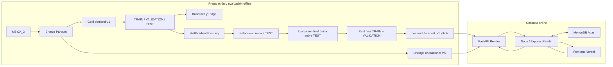

# Módulo de Machine Learning: demanda `demand-v1`

Este módulo prepara datos históricos M5, entrena y evalúa un modelo de demanda, empaqueta un artefacto confiable y lo sirve mediante una API privada. La predicción estima unidades vendidas durante los próximos siete días. La aplicación presenta esa estimación junto con una recomendación operativa calculada por el backend Node.

El entrenamiento es un proceso offline. Las consultas de la aplicación realizan inferencia con el modelo ya empaquetado; no entrenan ni actualizan el modelo.

## Arquitectura



Node autentica al usuario y aplica el tenant, consulta MongoDB para obtener historial y stock histórico, y calcula la recomendación. FastAPI valida la solicitud, combina el historial recibido con el lineage preparado, construye las 31 features y ejecuta el pipeline serializado. FastAPI no usa MongoDB; el navegador no llama directamente al servicio ML.

## Datos y target

La fuente de modelado es el store **CA_3** de M5 Forecasting. El Bronze local validado contiene:

- 3.049 productos;
- 1.941 días, del 2011-01-29 al 2016-05-22;
- 5.918.109 observaciones producto-día;
- 11.363.540 unidades vendidas.

Los ceros previos a la introducción del producto no se consideran observaciones activas. Gold identifica el inicio activo mediante el primer día con precio M5 no nulo y excluye filas pre-introduction. Las filas elegibles requieren calentamiento, continuidad temporal y horizonte objetivo completo. La ausencia de una venta no demuestra por sí sola que nunca hubo una venta; el serving exige evidencia observada o cobertura desde `active_start` para calcular recencia.

El target se define exactamente como:

```text
target_units_next_7_days = sum(units_sold t+1 ... t+7)
prediction_time = end_of_day_t
```

El horizonte es de siete días. El target usa ventas futuras porque son lo que se intenta predecir; ninguna feature usa datos posteriores a `t`.

## Features `demand-v1`

El orden oficial está en `ml/models/demand_forecast_v1_contract.json`. No debe cambiarse sin una nueva versión de contrato y una evaluación compatible.

| Grupo | Features |
| --- | --- |
| Categoría | `cat_id`, `dept_id` |
| Antigüedad activa | `active_age_days` |
| Demanda actual y rezagos | `current_units`, `lag_1`, `lag_7`, `lag_14`, `lag_28`, `lag_56` |
| Ventanas móviles | `rolling_sum_7`, `rolling_mean_28`, `rolling_std_28`, `rolling_mean_56` |
| Recencia y frecuencia | `days_since_last_sale`, `has_prior_sale`, `sale_days_last_28`, `nonzero_rate_56` |
| Calendario | `day_of_week`, `week_of_year`, `month`, `quarter`, `is_weekend` |
| Eventos y promoción | `event_name_1`, `event_type_1`, `event_name_2`, `event_type_2`, `snap_CA` |
| Precio | `sell_price`, `price_change_pct_7`, `price_relative_to_recent_mean_28`, `price_missing_active` |

Son 31 features. `item_id` y `store_id` identifican registros en Gold, pero no entran como features. Las categorías se codifican en el pipeline entrenado; una categoría no vista se representa según el contrato del encoder.

## Particiones temporales

| Partición | Fechas de predicción |
| --- | --- |
| TRAIN | hasta 2015-11-15 |
| Embargo | 2015-11-16 a 2015-11-22 |
| VALIDATION | 2015-11-23 a 2016-02-14 |
| Embargo | 2016-02-15 a 2016-02-21 |
| TEST | 2016-02-22 a 2016-05-15 |

Los targets de las últimas fechas TEST usan observaciones hasta 2016-05-22. El embargo de siete días separa ventanas objetivo que de otro modo se solaparían entre particiones. Las particiones siguen el tiempo para reducir fuga temporal.

## Modelo y resultados

El modelo seleccionado es **HGB-B**, implementado como `HistGradientBoostingRegressor`, con preprocesamiento y estimador guardados juntos. Los parámetros registrados en `model_metadata.json` son: `loss=squared_error`, `early_stopping=true`, `validation_fraction=0.05`, `n_iter_no_change=20`, `max_iter=250`, `learning_rate=0.05`, `max_leaf_nodes=63`, `min_samples_leaf=200`, `l2_regularization=1.0`, `random_state=2026`; alcanzó 250 iteraciones. Los valores del artefacto oficial son la referencia si este resumen y metadata divergen.

| Medición | HGB-B | Baseline promedio cuatro semanas |
| --- | ---: | ---: |
| VALIDATION WAPE | 0.333111 (33.3111 %) | — |
| TEST WAPE | 0.302878 (30.2878 %) | 0.319434 (31.9434 %) |
| TEST MAE | 4.4177 unidades | 4.6591 unidades |
| TEST RMSSE | 9.4264 | 9.4956 |

La mejora relativa de WAPE frente al baseline en TEST es aproximadamente **5.18 %**. Un WAPE de 30.29 % no significa “69.71 % de accuracy”. El RMSSE registrado usa la escala descrita en metadata (diferencias de primer orden del target de siete días por producto sobre anclas TRAIN consecutivas); no es el WRMSSE oficial de la competencia M5.

TEST se evaluó una vez para seleccionar/cerrar el experimento, antes del refit. El joblib final se ajustó con TRAIN + VALIDATION (4.266.619 filas). TEST quedó fuera de ese ajuste y no se volvió a usar para ajustar decisiones. Las métricas TEST describen el modelo de evaluación anterior al refit, no una reevaluación independiente del artefacto final.

## Artefactos

| Artefacto | Propósito |
| --- | --- |
| `ml/data/bronze/m5_store_daily.parquet` | M5 CA_3 normalizado a grano producto-día |
| `ml/data/gold/demand_features_v1.parquet` | Target, features causales y particiones temporales |
| `ml/data/gold/demand_features_v1_manifest.json` | Hashes, conteos, esquema y validación Gold |
| `ml/data/serving/cloud_demo_*_lineage.parquet` | Lineage de producto, calendario y precio para serving |
| `ml/models/demand_forecast_v1.joblib` | Preprocesador y estimador final confiables |
| `ml/models/model_metadata.json` | Métricas, parámetros, versiones, hash y procedencia |
| `ml/models/demand_forecast_v1_contract.json` | Orden, tipos y semántica de las 31 features |

Raw M5, Bronze, Gold, datos operacionales y otros archivos grandes pueden estar ignorados por Git y no existir en un clon ligero. El repositorio permite versionar explícitamente los tres artefactos oficiales de `demand-v1`; verifica el hash del joblib contra metadata antes de utilizarlo. No descargues datos ni generes datasets automáticamente al ejecutar pruebas.

## CLOUD-DEMO y fechas

`ML-CLOUD-DEMO` es un escenario operacional preparado con 60 productos derivados/sintéticos para demostrar el flujo de inferencia. **No es el dataset de entrenamiento:** HGB-B se entrenó con 3.049 productos M5 CA_3. El escenario conserva una fuente histórica hasta el ancla fuente **2015-06-30**, representada en la aplicación como ancla operacional **2025-07-01**, con un desplazamiento fijo de 3.654 días. Por ello es un replay histórico controlado, no un pronóstico de las condiciones actuales del mercado.

La prueba `R5C` compara automáticamente las 31 features entre Gold y serving para los 60 productos en esa ancla, con tolerancia `1e-5` para números e igualdad exacta para categorías. Si los artifacts de datos requeridos no están disponibles, la prueba hace un skip explícito; cuando están presentes, valida la comparación completa.

## Serving y estados

FastAPI carga el pipeline una vez al iniciar y comprueba el hash/tamaño del artefacto. Sus rutas son:

- `GET /health`: salud y metadata pública mínima del runtime;
- `GET /ready`: informa si el modelo está listo;
- `POST /v1/predict/demand`: inferencia por lote, protegida con `X-ML-Service-Secret`.

La API no conecta a MongoDB ni habilita CORS para llamadas directas desde el navegador. Acepta hasta 60 items y hasta 366 filas diarias por item. El middleware limita el body real a 2 MiB, incluso sin `Content-Length`; SKU y `productId` duplicados en un lote se rechazan. Los errores de validación y del servicio se devuelven sanitizados.

Estados principales por producto: `READY`, `INSUFFICIENT_HISTORY`, `MISSING_LINEAGE`, `MISSING_PRICE_HISTORY`, `MISSING_CALENDAR`, `INVALID_HISTORY` e `INVALID_FEATURES`. El runtime también puede responder `MODEL_UNAVAILABLE` cuando no puede servir el modelo. Los productos no `READY` no reciben una predicción numérica.

Se requieren al menos 57 días continuos para lags y ventanas. Es una condición necesaria para esas features, pero no siempre suficiente para recencia: si no hay ventas positivas en el historial recibido y este empieza después de `active_start`, el serving no inventa `has_prior_sale` ni `days_since_last_sale` y devuelve `INSUFFICIENT_HISTORY`.

Un producto puede existir en el CRUD normal sin estar preparado para ML. Para quedar `READY` necesita lineage compatible, historial suficiente y continuo, calendario y precios requeridos. Si no se demuestra esa cobertura, no se fabrica una predicción.

## Responsabilidades de Node y presentación

El endpoint de forecast Node está protegido por la autenticación/tenant normal. Node limita el escenario a CLOUD-DEMO, consulta el historial en MongoDB, reconstruye stock al ancla y envía una llamada batch a FastAPI. El cliente tiene timeout de **10 segundos** y no aplica retries automáticos. Node valida estrictamente que una respuesta `READY` traiga `predictedDemand7d` como número finito y no negativo; rechaza respuestas malformadas.

`predictedDemand7d` es salida ML. `recommendedQty` no lo predice el modelo: Node calcula:

```text
safetyStock = max(minStockLevel, predictedDemand7d * 0.20)
recommendedQty = ceil(max(0, predictedDemand7d + safetyStock - stockAtAnchor))
```

Node deriva `OK`, `VIGILAR` o `REPONER` a partir de esos valores. El frontend `/demand-forecast` separa entrenamiento previo de inferencia actual, muestra predicción frente a recomendación del sistema y permite retry manual cuando el servicio está temporalmente indisponible. `ML_NOT_READY` presenta un mensaje de preparación distinto del error temporal.

## Despliegue y cold start

Comando de build del servicio FastAPI:

```sh
pip install -r ml/requirements.txt
```

Comando de inicio usado por el servicio Python:

```sh
python -m uvicorn ml.service.app:app --host 0.0.0.0 --port "$PORT" --workers 1
```

Variables del servicio ML: `PYTHON_VERSION` (Python 3.12.10 en el entorno validado) y `ML_SERVICE_SECRET`. Node configura `ML_ENABLED=true`, `ML_SERVICE_URL` y el mismo `ML_SERVICE_SECRET`. Los secretos se configuran en el proveedor de despliegue; no se guardan en este repositorio. FastAPI no necesita variables MongoDB.

Render Free puede suspender el servicio y hacer que la primera petición tarde o falle por cold start. Para una demostración, despierta los servicios antes de entrar: comprueba `/health` del backend, abre `/ready` del servicio ML, espera una respuesta `200`, y luego inicia sesión y abre `/demand-forecast`. La pantalla permite retry manual. No se recomienda keepalive artificial.

## Comandos de desarrollo y reproducibilidad

Desde la raíz del repositorio en PowerShell:

```powershell
python -m venv ml/.venv
ml/.venv/Scripts/python.exe -m pip install -r ml/requirements.txt
ml/.venv/Scripts/python.exe -m ml.src.ingest.profile_m5 --write-manifest
ml/.venv/Scripts/python.exe -m ml.src.normalize.build_bronze
ml/.venv/Scripts/python.exe -m ml.src.features.build_demand_gold
ml/.venv/Scripts/python.exe -m ml.src.features.validate_demand_gold
ml/.venv/Scripts/python.exe -m ml.src.training.train_ridge
ml/.venv/Scripts/python.exe -m ml.src.training.train_hgb_full
ml/.venv/Scripts/python.exe -m ml.src.training.evaluate_r4_test
ml/.venv/Scripts/python.exe -m ml.src.training.refit_final_model
ml/.venv/Scripts/python.exe -m ml.src.serving.build_cloud_demo_lineage
ml/.venv/Scripts/python.exe -m unittest discover -s ml/tests -v
```

El orden anterior describe el pipeline reproducible, no una invitación a reentrenar o reevaluar el artefacto oficial. La evaluación TEST es una etapa única ya cerrada. Los comandos de Gold/modelo requieren los artifacts pesados correspondientes. Se recomienda Python **3.12.10** y las dependencias fijadas en `ml/requirements.txt`; metadata registra NumPy 2.3.3, SciPy 1.16.2, scikit-learn 1.7.2, joblib 1.6.0, DuckDB 1.5.5 y pandas 2.3.2. Las configuraciones del dataset y entrenamiento fijan la semilla `2026`.

La suite Python cubre `R2A`, `R2B`, `R3B`, `R4B`, `R4D`, `R5B`, `R5C` y `R5D`. Parte de las pruebas con Gold/Bronze pesados hace skip con una razón clara si faltan esos artifacts; no descarga ni reconstruye datos. La suite también cubre el runtime/API y la paridad 60 × 31. En backend hay pruebas del servicio Node→ML y en frontend hay pruebas helper y pruebas de comportamiento con Vitest, React Testing Library y jsdom. No se publica un porcentaje de cobertura porque no se ha medido.

Comandos de prueba del backend y del frontend (desde sus respectivas carpetas):

```sh
npm test
npm run test:ml-forecast
```

En la suite Python, `test_r2a.py` cubre ingesta/perfilado y Bronze; `test_r2b.py` escenarios operacionales; `test_r3b.py` Gold; `test_r4b.py` entrenamiento reproducible; `test_r4d.py` evaluación/refit; `test_r5b.py` lineage; `test_r5c.py` feature builder y paridad completa; `test_r5d.py` runtime y API. El runner ML los descubre con el comando unittest anterior.

## Seguridad y uso

- Mantén `ML_SERVICE_SECRET` fuera del código, de logs y del navegador; el secreto se comparte solo entre Node y FastAPI.
- El browser se comunica con Node. FastAPI no habilita CORS para llamadas browser.
- Carga el joblib únicamente desde el artefacto de aplicación confiable y verificado; los archivos joblib/pickle pueden ejecutar código al cargarse.
- El límite de body, límites de esquema, autenticación de servicio y errores sanitizados protegen la frontera FastAPI.

El uso actual está acotado a demo académica, replay histórico controlado y predicción de demanda de siete días para productos con lineage e historial válidos. No se deben convertir las sugerencias en compras automáticas ni presentarlas como una garantía de ventas.

## Limitaciones conocidas

- Dataset de una sola tienda (CA_3), con el horizonte histórico M5; no representa todos los comercios ni el mercado actual.
- CLOUD-DEMO tiene 60 productos operacionales preparados y sintéticos; el producto nuevo no queda soportado automáticamente.
- Serving utiliza lineage derivado de M5 y un ancla histórica fija; no predice “hoy” sin una preparación y evaluación nuevas.
- El resultado TEST es una evaluación histórica anterior al refit final y no equivale a una evaluación independiente del modelo refit.
- WAPE/RMSSE tienen limitaciones para series intermitentes; RMSSE puede ser inestable en series de baja demanda.
- Render Free puede tener cold start.
- La predicción es consultiva; no hace compras ni reemplaza el juicio comercial.
- CLOUD-DEMO y el despliegue de demostración no equivalen a una validación de producción.

Para el resumen del modelo, el hash oficial y una declaración más completa de uso y limitaciones, consulta [`MODEL_CARD.md`](MODEL_CARD.md).
